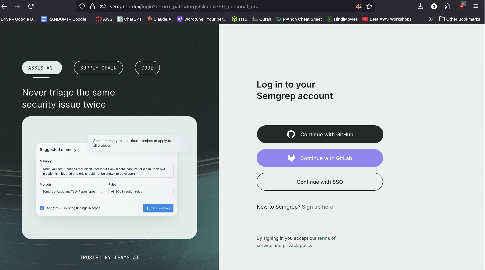
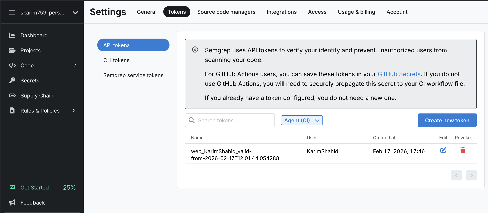
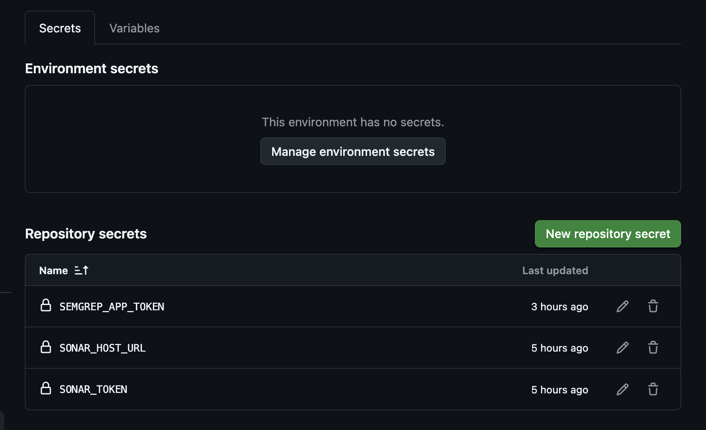
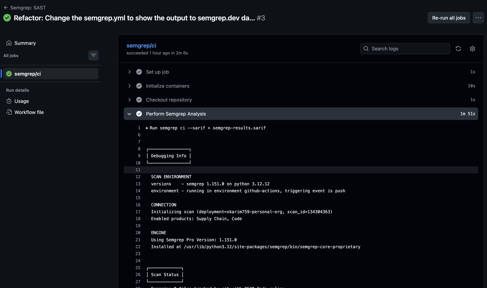
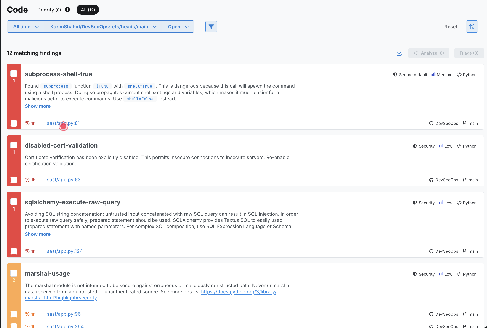
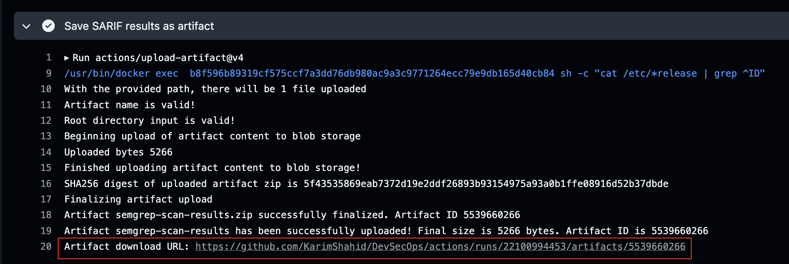

# Semgrep SAST

Static Application Security Testing (SAST) using Semgrep, integrated with GitHub Actions and semgrep.dev.

Semgrep is an open-source, fast, and efficient static analysis tool that can detect bugs, vulnerabilities, and enforce coding standards. By seamlessly integrating Semgrep into our GitHub Actions workflows, we can take our code quality to the next level.


## Overview

This setup uses Semgrep to automatically scan source code for security vulnerabilities on every push to `main` or via manual trigger. Findings are uploaded to semgrep.dev and a SARIF report is saved as a downloadable artifact in GitHub Actions.

---

## Project Structure
```
.
├── README.md
├── sast/
│   ├── app.py                   # Source code being scanned
│   └── aws.yaml
├── .github/
│   └── workflows/
│       └── semgrep.yml          # GitHub Actions workflow
└── sonar-project.properties
```

---

## Workflow
```yaml
name: "Semgrep: SAST"

on:
  workflow_dispatch: {}
  push:
    branches:
      - main

jobs:
  semgrep_scan:
    name: semgrep/ci
    runs-on: ubuntu-latest
    container:
      image: semgrep/semgrep
    if: github.actor != 'dependabot[bot]'
    permissions:
      contents: read
      actions: read
    steps:
      - name: Checkout repository
        uses: actions/checkout@v4

      - name: Perform Semgrep Analysis
        run: semgrep ci --sarif > semgrep-results.sarif
        env:
          SEMGREP_APP_TOKEN: ${{ secrets.SEMGREP_APP_TOKEN }}

      - name: Save SARIF results as artifact
        uses: actions/upload-artifact@v4
        with:
          name: semgrep-scan-results
          path: semgrep-results.sarif
        if: success() || failure()
```

### Triggers

| Trigger | Description |
|---|---|
| `push` to `main` | Automatically runs on every push to the main branch |
| `workflow_dispatch` | Manually triggered from the GitHub Actions tab |

### Steps

| Step | Description |
|---|---|
| Checkout repository | Pulls the source code into the runner |
| Perform Semgrep Analysis | Authenticates with semgrep.dev, scans code, uploads findings, generates SARIF |
| Save SARIF results as artifact | Uploads SARIF file as a downloadable artifact in GitHub Actions |

---

## Setup

### 1. Create a Semgrep Account
Sign up at [semgrep.dev](https://semgrep.dev) using your GitHub account.



### 2. Generate an Agent Token
Go to **semgrep.dev → Settings → Tokens → Create new token** and select **Agent (CI)** as the scope. Copy the token.



### 3. Add Token to GitHub Secrets
Go to **Settings → Secrets and variables → Actions → New repository secret** and add:

| Secret Name | Value |
|---|---|
| `SEMGREP_APP_TOKEN` | Your Semgrep agent token |



### 4. Push to Main
Push any change to `main` or manually trigger the workflow. The project is auto-created on semgrep.dev on the first run.



---

## Viewing Results

### On semgrep.dev
Go to **semgrep.dev → Code** to view findings by severity, rule, and file.



### As a SARIF Artifact
1. Go to **Actions** tab in your repo
2. Click the workflow run
3. Scroll down to **Artifacts**
4. Download **semgrep-scan-results**




Open the `.sarif` file in VS Code with the [SARIF Viewer extension](https://marketplace.visualstudio.com/items?itemName=MS-SarifVSCode.sarif-viewer) for a rich UI.

---

## Key Decisions

`semgrep ci` connects to semgrep.dev, authenticates via token, and uploads findings automatically. Rules are configured on the platform rather than hardcoded in the workflow.

**`if: success() || failure()` on artifact upload**
Semgrep exits with code `1` when findings are detected, which skips subsequent steps by default. This condition ensures the SARIF file is always uploaded.

**Dependabot exclusion**
Dependabot PRs cannot access secrets, so the job is skipped to avoid failures.

---

## Free Tier Limitations

| Feature | Free | Paid |
|---|---|---|
| Code (SAST) findings | ✅ | ✅ |
| Secrets detection | ✅ | ✅ |
| Supply Chain | ✅ | ✅ |
| Dashboard with trends/metrics | ❌ | ✅ |
| GitHub Advanced Security | ❌ (public repos only) | ✅ |