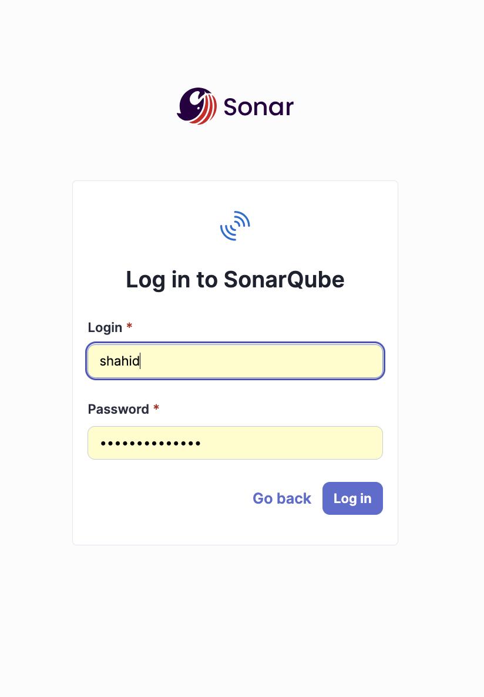
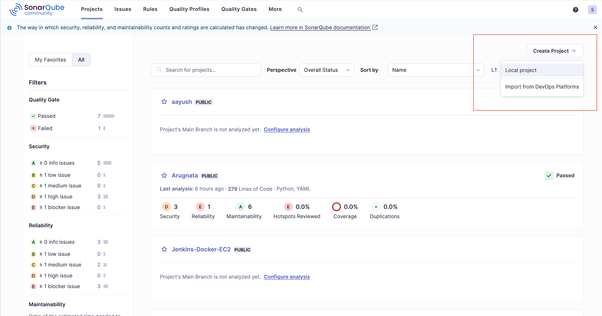
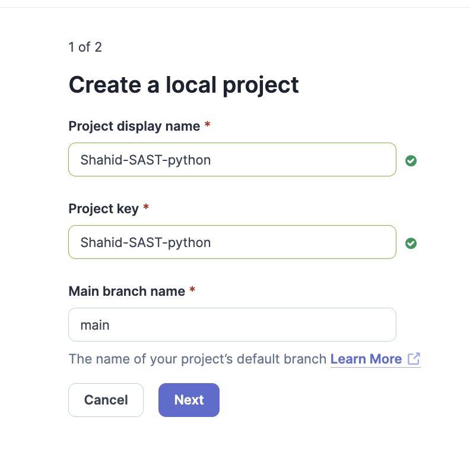
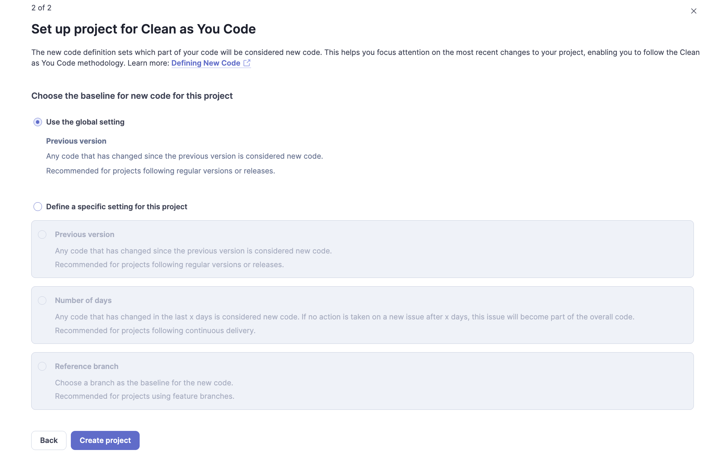
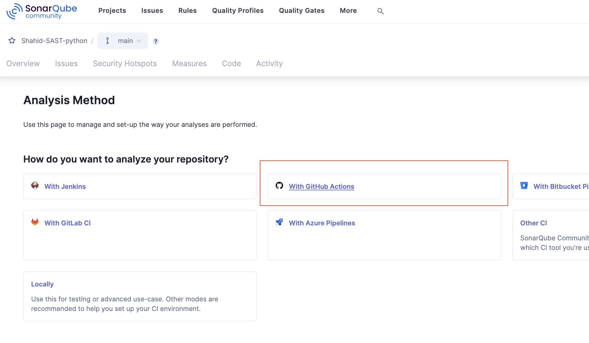
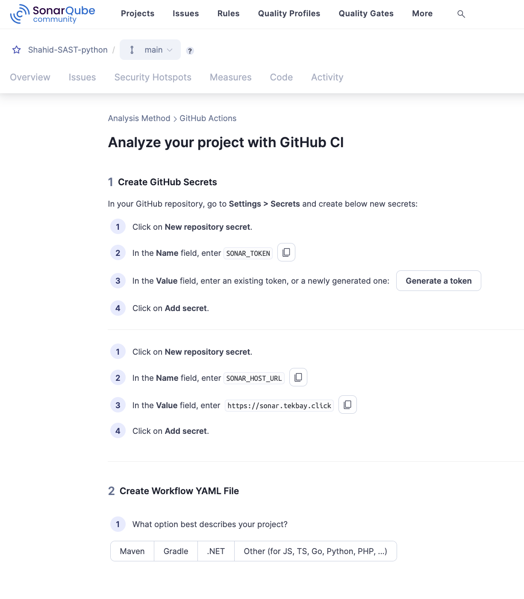
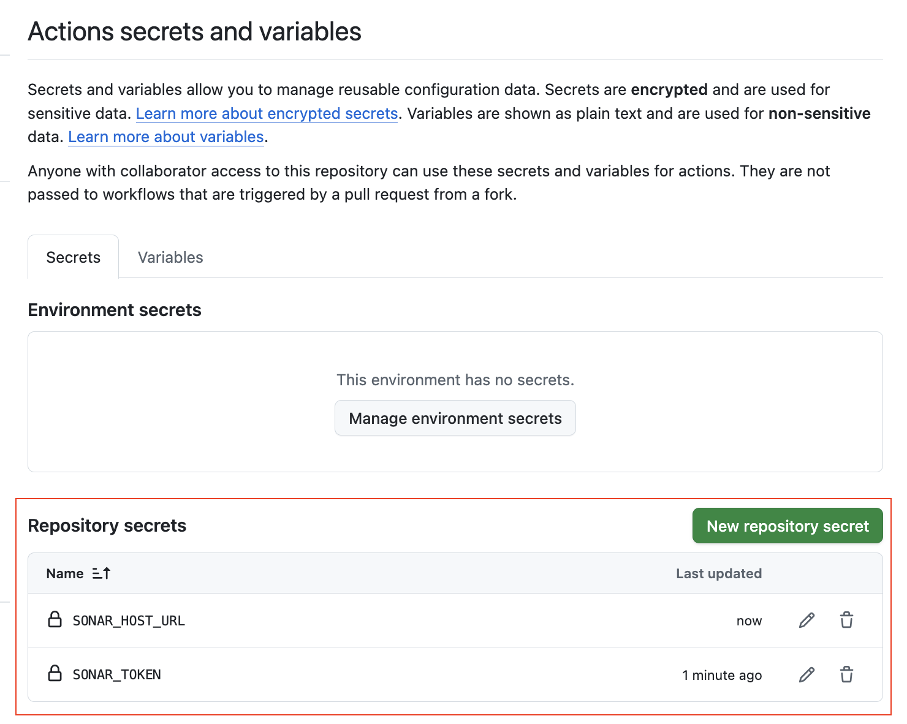
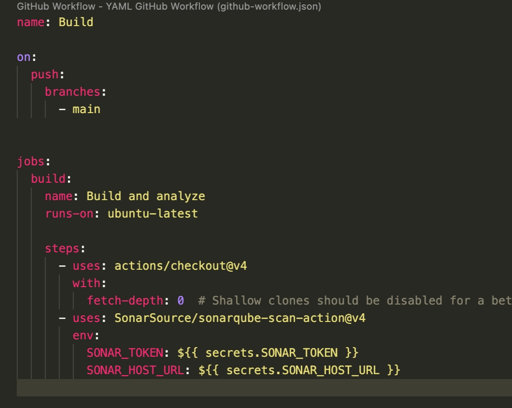
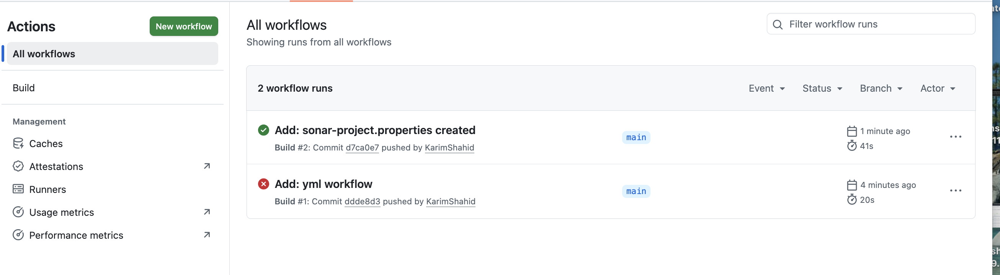
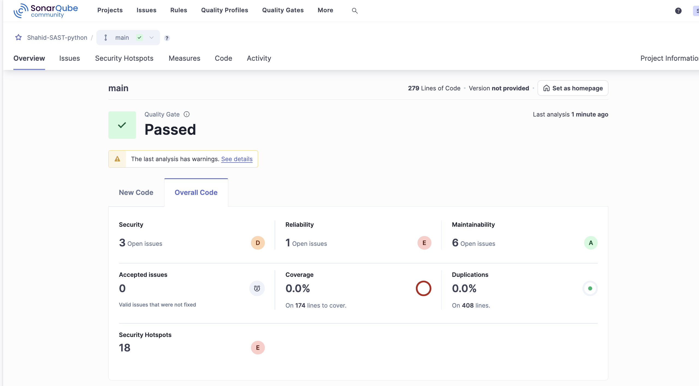

# SonarQube SAST

Static Application Security Testing (SAST) using SonarQube, integrated with GitHub Actions.

---

## Prerequisites

- SonarQube Server configured and running
- Web application for testing
- GitHub repository access

---

## 1. Login

Log in to your SonarQube instance.



---

## 2. Create a Project

From the dashboard, create a new project.



### Enter Project Name and Project Key

Provide a unique project name and key to identify your project within SonarQube.



### Select Global Settings

SonarQube follows the **Clean as You Code** methodology — only code changed since the last project version is considered *New Code* and evaluated against the Quality Gate.



### Select GitHub Actions as the Analysis Method

Choose GitHub Actions as the CI/CD method to trigger scans automatically on push and pull requests.



---

## 3. Configure GitHub Secrets and Workflow

### Add Secrets

SonarQube will provide a token and host URL. Add these to your GitHub repository under **Settings → Secrets and variables → Actions**.

| Secret Name | Description |
|---|---|
| `SONAR_TOKEN` | Authentication token from SonarQube |
| `SONAR_HOST_URL` | URL of your SonarQube server |



### Create the Workflow File

Create the following workflow file in your repository:
```bash
.github/workflows/build.yml
```





---

## 4. Check GitHub Actions

Once pushed, the workflow will trigger automatically. Go to the **Actions** tab in your repository to monitor the scan progress.



---

## 5. View Results in SonarQube

After the workflow completes, navigate back to your SonarQube project to view the full analysis report including bugs, vulnerabilities, code smells, and coverage.

